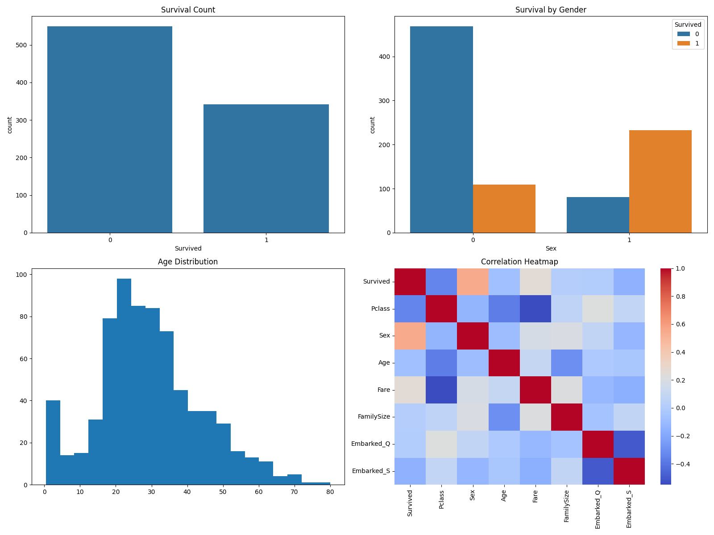

# Titanic Survival Prediction 🚢

## 📌 Overview
This project predicts whether a passenger survived the Titanic disaster using machine learning. It demonstrates a complete data science workflow including data preprocessing, visualization, model building, and evaluation.

---

## 🎯 Objective
To analyze passenger data and build a classification model that predicts survival based on various features.

---

## 🛠️ Technologies Used
- Python  
- Pandas, NumPy  
- Matplotlib, Seaborn  
- Scikit-learn  

---

## 🔄 Workflow
1. Data Cleaning  
2. Feature Engineering  
3. Data Visualization  
4. Model Building (Logistic Regression)  
5. Model Evaluation  

---

## 📊 Features Used
- Age  
- Sex  
- Pclass  
- Fare  
- FamilySize  

---

## 📈 Results
- Accuracy: ~75–85%  
- Evaluated using:
  - Confusion Matrix  
  - Precision, Recall, F1-score  

---

## 📷 Visualizations

### 🔹 Data Visualization



### 🔹 Confusion Matrix


---

## 🖥️ Model Output (Terminal Screenshot)


## Porject Structure: 
titanic-survival-prediction/
│── titanic_survival_prediction.py
│── train.csv
│── visualizations.png
│── confusion_matrix.png
│── requirements.txt
│── README.md


## 🚀 Conclusion

This project demonstrates how machine learning can be used to extract meaningful insights and make predictions from real-world datasets.
Example:
```markdown
